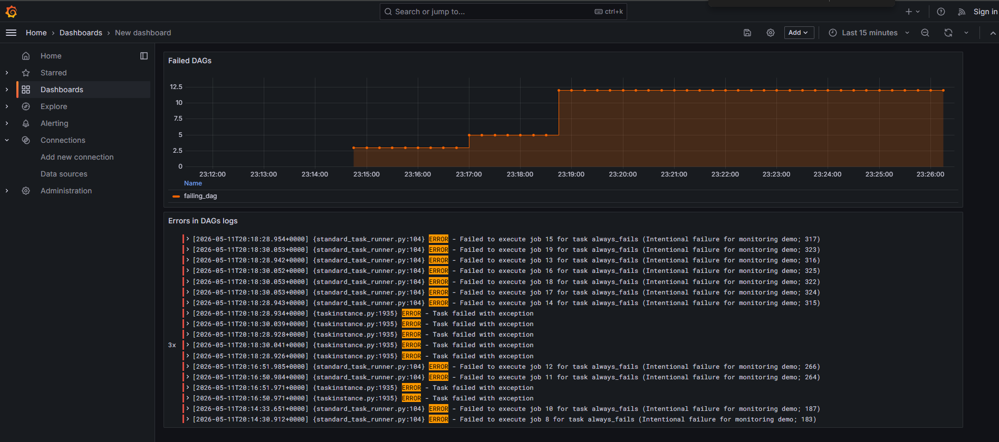

# **ITMO DevOps Lab 4: Loki + Prometheus + Grafana.**

## **Этот проект:**

 - расширяет стек Airflow + Spark из лабораторной 2 системой мониторинга,

 - собирает логи Airflow через Grafana Alloy и хранит их в Loki,

 - экспортирует метрики Airflow через плагин `airflow-exporter` в Prometheus,

 - экспортирует метрики Spark master и worker через встроенный `PrometheusServlet`,

 - визуализирует логи и метрики в едином дашборде Grafana.

## **Что делает мониторинг-стек:**

 - **Логи Airflow**: Airflow пишет `.log` файлы в `./logs/` → Alloy читает по маске `/opt/logs/dag_id=*/run_id=*/task_id=*/*.log` → форвардит в Loki → Grafana визуализирует.

 - **Метрики Airflow**: `airflow-exporter` публикует Prometheus-формат на `/admin/metrics/` → Prometheus скрейпит каждые 10 секунд → Grafana визуализирует.

 - **Метрики Spark**: встроенный `PrometheusServlet` отдаёт метрики master на `/metrics/master/prometheus/` и worker на `/metrics/prometheus/` → Prometheus скрейпит → Grafana визуализирует.

## **Архитектура проекта:**

```text
itmo-devops-labs/
│
├── dags/
│   ├── my_first_dag.py             # DAG лабораторной 1
│   ├── spark_sum_numbers_dag.py    # DAG лабораторной 2
│   └── failing_dag.py              # DAG, специально падающий — для ERROR логов и failed метрик
│
├── spark/
│   ├── sum_numbers_job.py          # PySpark job
│   └── metrics.properties          # конфигурация PrometheusServlet для Spark
│
├── alloy.conf                      # конфигурация сборщика логов Alloy
├── prometheus.yml                  # scrape-конфиг Prometheus
│
├── Dockerfile                      # образ Airflow с airflow-exporter
├── docker-compose.yml              # Airflow + Postgres + Spark + Loki + Alloy + Prometheus + Grafana
├── README.md                       # документация проекта
└── CHANGES.md                      # история изменений
```

## **Используемые технологии:**

 - Apache Airflow 2.7.1

 - Apache Spark 3.5.0

 - PySpark 3.5.0

 - PostgreSQL 13

 - Grafana Loki 3.2.0

 - Grafana Alloy v1.5.1

 - Prometheus v2.48.1

 - Grafana 11.2.0

 - airflow-exporter 1.5.3

## **Как задеплоить сервис локально:**

1. Клонировать репозиторий и переключиться на ветку:
```
git clone https://github.com/OlMiore/Itmo-devops-labs.git
cd Itmo-devops-labs
git checkout lab4
```

2. Собрать кастомный образ Airflow:
```
docker-compose build
```

3. Инициализировать Airflow (миграции БД, создание пользователя, подключение `spark_local`):
```
docker-compose up airflow-init
```

4. Запустить все сервисы:
```
docker-compose up -d
```

5. Открыть UI:

| Сервис | URL | Доступ |
|---|---|---|
| Airflow | http://localhost:8080 | airflow / airflow |
| Spark Master UI | http://localhost:4040 | — |
| Prometheus | http://localhost:9090 | — |
| Grafana | http://localhost:3000 | анонимный (Admin) |
| Loki API | http://localhost:3100 | — |

6. В Airflow запустить DAG'и:

 - `spark_sum_numbers_dag` — успешный, генерирует Spark-логи и метрики,

 - `failing_dag` — специально падает, наполняет панели ERROR-логами и метрикой `airflow_dag_status{status="failed"}`.

7. В Grafana подключить Data sources через `Connections → Data sources`:

 - **Loki**: URL `http://loki:3100`,

 - **Prometheus**: URL `http://prometheus:9090`.

8. Создать дашборд с двумя плитками:

 - **Logs** (Loki): `{job="airflow_logs"} |= "ERROR"`,

 - **Time series** (Prometheus): `airflow_dag_status{status="failed"}`.

## **Что было добавлено поверх Lab 2:**

### Логирование

 - Сервис **Loki** для хранения логов.

 - Сервис **Alloy** для сбора логов через volume `./logs:/opt/logs`.

 - Файл `alloy.conf` с конфигурацией:

   - `local.file_match` — поиск файлов по маске `/opt/logs/dag_id=*/run_id=*/task_id=*/*.log`,

   - `loki.source.file` — чтение и форвардинг,

   - `loki.write` — отправка в Loki по адресу `http://loki:3100/loki/api/v1/push`.

### Метрики

 - Сервис **Prometheus** на порту 9090.

 - В `Dockerfile` добавлен пакет `airflow-exporter==1.5.3` — плагин, публикующий метрики Airflow на `/admin/metrics/`.

 - В `prometheus.yml` три scrape-job'а:

   - `airflow` → `airflow-webserver:8080/admin/metrics/`,

   - `spark-master` → `spark-master:8080/metrics/master/prometheus/`,

   - `spark-worker` → `spark-worker:8081/metrics/prometheus/`.

 - Файл `spark/metrics.properties` со встроенным `PrometheusServlet` Spark, монтируется в оба spark-сервиса.

 - В `spark-master` и `spark-worker` добавлена переменная `SPARK_DAEMON_JAVA_OPTS=-Dspark.metrics.conf=/opt/spark/conf/metrics.properties` — без неё Spark не находит файл конфигурации метрик.

### Визуализация

 - Сервис **Grafana** на порту 3000 с анонимным доступом и правами Admin.

 - Volume `grafana-data` для сохранения датасорсов и дашбордов между рестартами.

## **DAG: failing_dag:**

DAG из одной задачи `always_fails`, которая всегда выбрасывает `RuntimeError`. Используется для генерации ERROR-логов и наполнения метрики `airflow_dag_status{status="failed"}` — без них дашборд мониторинга остаётся пустым.

## **Скриншот:**



